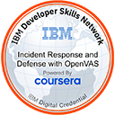
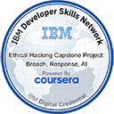
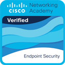
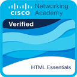
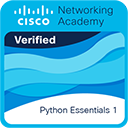
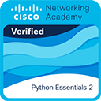
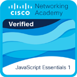
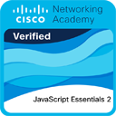

# Hi 👋, I'm Jakub Gawron

Full-stack developer focused on backend, Linux and cybersecurity.
In my free time I build and break things to learn how they work.

<!-- Check out my [portfolio](https://localhost). -->

---

## 🛠️ Tech Stack

### Languages & Technologies

  <picture>
    <source media="(prefers-color-scheme: dark)" srcset="https://skillicons.dev/icons?i=py%2Cnodejs%2Cjs%2Cts%2Chtml%2Ccss%2Cbootstrap%2Cbash%2Cpowershell&theme=dark">
    
  </picture>

### Tools & Operating Systems

  <picture>
    <source media="(prefers-color-scheme: dark)" srcset="https://skillicons.dev/icons?i=git%2Cgithub%2Clinux%2Ckali%2Cwindows%2Cdocker%2Cnginx%2Cmysql%2Csqlite&theme=dark">
    
  </picture>

### Design

  <picture>
    <source media="(prefers-color-scheme: dark)" srcset="https://skillicons.dev/icons?i=ps%2Cai%2Cblender%2C%2C%2C%2C%2C%2C&theme=dark">
    
  </picture>

---

## 🎓 Certifications

  
  
  
  
  
  
   
  
  
  
  
  
  

